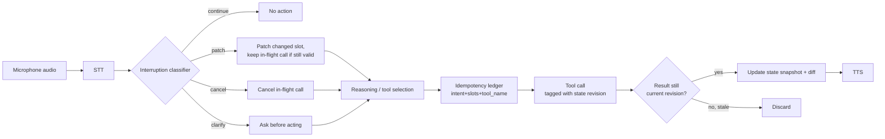

# duplex-agent

**Samsung PRISM — Theme 05: Interruptible Real-Time Agents**
Team of 4 · 2-day build window

> Status: skeleton — fill in as P1/P2/P3 land their pieces. Sections marked `TODO` need real content before submission.

## Problem

A voice-native agent, built inside the [LiveKit agents framework](https://github.com/livekit/agents), that:

- **Stays responsive** — spoken feedback within a few hundred ms, no dead air, no false "done" claims
- **Works asynchronously** — tool calls, perception, and reasoning never block the conversation
- **Recovers cleanly** — mid-utterance corrections discard stale intent, update tool args, and never repeat a state-changing action

Evaluated against **[Full-Duplex-Bench v3 (FDB-v3)](https://github.com/DanielLin94144/Full-Duplex-Bench)** — a real, public benchmark ([paper](https://arxiv.org/abs/2604.04847)) of 100 human recordings across 79 scenarios, 12 speakers, 5 annotated disfluency types, and 12 mock tools across 4 domains with chained calls up to 3 levels deep.

Published baselines we're aiming to beat (or at least know where we land against):

| Model | Strict Pass@1 | First response | Tool call latency | Task completion latency |
|---|---|---|---|---|
| GPT-Realtime | 60.0% | 6.36s | 3.89s | 6.89s |
| Gemini Live 3.1 | 54.0% | 3.95s | 2.21s | 4.25s |
| Cascaded (Whisper→GPT-4o→TTS) | — | — | — | 10.12s |

The paper's headline finding — self-correction handling and multi-step tool chains are where every published system loses points — is exactly what our interruption-decision logic is meant to address.

## Architecture

Cascaded template (STT → reasoning/decision → TTS), not a realtime speech API — chosen for 2 days / 4 people because it's easier to insert our own interruption-classification and state-management layer between STT and TTS.



Carried over from the original design, now living inside the LiveKit agent's reasoning stage:

1. **Interruption classifier** — every interruption/self-correction is one of `continue` / `patch` / `cancel` / `clarify` before any action is taken. Defaults to `clarify` on low confidence (a wrong guess costs Task Completion; asking doesn't).
2. **Versioned state snapshots** — `revision`, `intent`, `slots`, with a recorded diff on every correction.
3. **Idempotency ledger** — keyed by `intent + normalized_slots + tool_name`; never repeats a state-changing tool call.
4. **Revision-tagged tool calls** — a result from a superseded revision is discarded on arrival, regardless of whether cancellation succeeded first.
5. **Cancellation** — wired to whatever concurrency primitive the LiveKit agent runtime uses for in-flight tool calls.

## Repo structure

`TODO` — fill in once P1's LiveKit agent skeleton lands. For reference, the FDB-v3 harness itself (which our agent plugs into) is laid out like this — our own code most likely lives as a modified `cascaded_agent.py` plus whatever new modules P1/P2 add for the classifier/ledger/state logic:

```
v3/
├── cascaded_agent.py                    # <- our starting point: Silero VAD + Whisper STT + gpt-4o + OpenAI TTS
├── lk_agent_tool.py                     # native realtime agent (GPT Realtime/Gemini/Grok/Ultravox) — not our path
├── mock_apis.py                         # the 12 mock tool backends
├── benchmark_data_v2.json               # 79 scenario definitions
├── run_tool_benchmark_all_released.py   # batch inference — streams all 100 recordings through our agent
├── evaluate_tool_calls.py               # F1 / argument accuracy / response quality
├── evaluate_pass_rate.py                # strict binary pass/fail
├── analyze_tool_latency.py              # latency breakdown
└── fdb_v3_data_released/                # benchmark audio + metadata (downloaded separately, not in git)
```

## Setup & run

Confirmed from the actual FDB-v3 `v3/README.md`:

```bash
# 1. Environment
conda create -n fdb python=3.10 && conda activate fdb
pip install "livekit-agents[openai,google,xai]~=1.3" "livekit-plugins-ultravox" python-dotenv
pip install "livekit-plugins-silero" "livekit-plugins-openai"   # cascaded agent deps
pip install "livekit[crypto]~=1.0" numpy
pip install nemo_toolkit[asr]        # ASR model used to transcribe the agent's spoken response for eval
pip install pydub ffmpeg-python openai
# external: ffmpeg (apt install ffmpeg / brew install ffmpeg)

# 2. .env.local in v3/
# LIVEKIT_URL / LIVEKIT_API_KEY / LIVEKIT_API_SECRET   (free LiveKit Cloud account)
# OPENAI_API_KEY                                        (cascaded agent + gpt-4o judge)

# 3. Benchmark data — NOT in git, download manually:
# https://drive.google.com/file/d/1SO_4MTazWQ_jvCx0dtmpQ-t40bdd07yz/view
# extract fdb_v3_data_released/ into v3/

# 4. Run — three terminals worth of steps, in order:
cd v3
python cascaded_agent.py start                                    # Terminal 1: our agent, stays running
python run_tool_benchmark_all_released.py --provider cascaded      # Terminal 2: batch inference, all 100 recordings
bash run_all_evaluations_released.sh                                # Terminal 2, after inference finishes: scoring
```

`TODO` — once this actually works end to end on our modified agent, wrap steps 1–4 into one script (`reproduce.sh` or similar) per the submission checklist's "one-command reproduction script" requirement. Two things worth flagging now, both squarely in **your** lane as the person testing this on a clean machine:

1. **The benchmark data is a manual Google Drive download, not a git-tracked file or a `wget`-able URL.** A true "one command" script either needs to script that download (`gdown`, if the file permissions allow it) or the README needs to say clearly "download this first, by hand" — otherwise the org's re-run stalls on step 1 and that's 60% of the score at risk.
2. **`nemo_toolkit[asr]` is a heavy dependency** (NVIDIA's ASR toolkit) and the original hackathon PRD mentioned a "single 48GB GPU" as the standard eval machine — worth confirming with P3 whether the ASR step needs that GPU or can run on CPU/smaller hardware, since "clean machine" for your test needs to match whatever the organizers actually run on.

## The 12 mock tools (confirmed from FDB-v3)

| Domain | Tools |
|---|---|
| Travel & Identity | `search_flights`, `book_flight`, `update_identity_doc` |
| Finance & Billing | `get_card_benefits`, `get_exchange_rate`, `modify_autopay` |
| Housing & Location | `search_apartments`, `calculate_commute`, `update_search_filter` |
| E-Commerce | `track_order`, `search_products`, `add_to_cart` |

## Extension use case

`TODO` — one new use case beyond the benchmark's 4 domains, working end-to-end, shown in the demo video (not a slide sketch). Candidates from the PRD: in-car destination change, device troubleshooting with a camera frame, hands-free kitchen assistant. P3 picks and builds one fully rather than splitting effort.

## Benchmark results

`TODO` — our best run's scores, seeds, and config, once P3 has FDB-v3 running end-to-end against the complete agent (Day 2 AM per the timeline).

## Status

| Module | Owner | Status |
|---|---|---|
| P1 — LiveKit agent core + orchestration logic | — | Not started |
| P2 — Reasoning & tool-calling | — | Not started |
| P3 — Benchmark integration & extension | — | Not started |
| P4 — README, video, slides, test runs | Manas | This README skeleton |

## Hard constraints (disqualification risks)

- Never hardcode/memorize/fine-tune on FDB-v3 test items — it's public, they check
- No calling our own servers at evaluation time — all agent logic must live in the submission
- No caching across scenarios — each conversation starts fresh
- Pin seeds and versions so the organizers' re-run matches our logs

## Submission checklist

- [ ] Code repo with this README (architecture diagram, exact setup/run steps, extension clearly marked)
- [ ] One-command reproduction script, verified on a clean machine
- [ ] Our own benchmark run logs (scores, seeds, config)
- [ ] Extension use case, working end-to-end, shown in the video
- [ ] Demo video, 3–5 min, unedited single takes preferred
- [ ] Slide deck, max 8 slides
- [ ] Submitted via the Google Form (one final upload counts)

## Team

**P1 — LiveKit Agent Core + Orchestration Logic:** LiveKit setup, interruption classifier wiring, state/revision system, idempotency ledger, tool-call cancellation.

**P2 — Reasoning & Tool-Calling:** LLM intent detection, slot extraction, tool selection against FDB-v3's 12 mock tools, structured state-snapshot output.

**P3 — Benchmark Integration & Extension:** FDB-v3 setup, baseline run, one-command reproduction script, run logs, the extension use case.

**P4 — README, Video, Slides, Test Runs (Manas):** This document, architecture diagram, demo video, slide deck, and independent verification of the reproduction script on a clean machine.