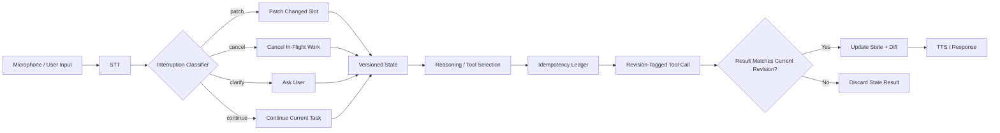

# Duplex Agent

> **Event-driven orchestration for interruptible real-time AI agents with versioned state, cancellation, stale-result protection, and idempotent tool execution.**

**Samsung PRISM — Theme 05: Interruptible Real-Time Agents**
**Team size:** 4
**Role:** P4 — README, demo video, slides & verification

<<<<<<< Updated upstream
Demo Video: https://youtu.be/EmWn4vT35p4
=======
---
>>>>>>> Stashed changes

##  Demo

The demo shows the agent handling an interruption in the middle of a tool-driven task, updating the state revision, protecting against stale results, and recording the resulting tool execution in the ledger.

### Demo Video

> **Note:** After uploading the video to GitHub, replace `VIDEO_URL_HERE` with the GitHub-generated video URL.

<video src="VIDEO_URL_HERE" controls width="100%"></video>

**[▶ Watch the Full Demo](VIDEO_URL_HERE)**

### What the Demo Shows

* Initial request: **“Find me a flight to Mumbai on October 4.”**
* The agent dispatches a `flight_search` tool call for revision `v1`.
* The user interrupts: **“Actually make that October 5.”**
* The interruption is classified as a **PATCH** rather than a new independent task.
* Only the changed slot (`date`) is updated.
* State advances from **revision `v1` → `v2`**.
* The stale `v1` result is protected from becoming the final state.
* The `v2` tool call completes and is recorded by the **Tool Ledger**.

---

##  The Problem

Real-time AI agents cannot behave like ordinary request/response applications.

While an agent is reasoning or executing a tool call, the user can change their mind, correct a value, cancel the request, or add new information. A naive implementation can then:

* execute outdated tool calls,
* overwrite newer state with stale results,
* repeat state-changing actions,
* lose track of which version of the user's intent is active, or
* become unresponsive while waiting for tools.

**Duplex Agent** introduces an event-driven orchestration layer that treats every correction as a state transition and every tool result as valid only for the revision that created it.

---

##  Core Capabilities

| Capability                      | Purpose                                                                  |
| ------------------------------- | ------------------------------------------------------------------------ |
| **Interruption classification** | Classifies interruptions as `continue`, `patch`, `cancel`, or `clarify`. |
| **Versioned state**             | Every meaningful correction produces a new state revision.               |
| **Stale-result protection**     | Results from superseded revisions cannot overwrite current state.        |
| **Cancellation**                | In-flight work can be cancelled when the active intent changes.          |
| **Idempotency ledger**          | Prevents duplicate state-changing tool execution.                        |
| **Revision-tagged tools**       | Every tool call carries the state revision that created it.              |
| **State diffs**                 | Corrections expose exactly what changed between revisions.               |
| **Event stream**                | Makes the complete orchestration lifecycle observable.                   |
| **Tool ledger**                 | Records dispatched operations, revisions, status and idempotency keys.   |

---

##  Architecture


```mermaid
flowchart LR
    A[Microphone / User Input] --> B[STT]
    B --> C{Interruption Classifier}

    C -->|continue| D[Continue Current Task]
    C -->|patch| E[Patch Changed Slot]
    C -->|cancel| F[Cancel In-Flight Work]
    C -->|clarify| G[Ask User]

    E --> H[Versioned State]
    F --> H
    G --> H
    D --> H

    H --> I[Reasoning / Tool Selection]
    I --> J[Idempotency Ledger]
    J --> K[Revision-Tagged Tool Call]
    K --> L{Result Matches Current Revision?}

    L -->|Yes| M[Update State + Diff]
    L -->|No| N[Discard Stale Result]

    M --> O[TTS / Response]
```

### State Lifecycle

```text
User intent
    ↓
State v1
    ↓
Tool call tagged v1
    ↓
User correction
    ↓
PATCH / CANCEL / CLARIFY
    ↓
State v2
    ↓
New tool call tagged v2
    ↓
Validate returned revision
    ├── current → accept
    └── stale   → discard
```

---

##  Interruption Handling

The orchestration layer separates **what the user changed** from **what the agent should do next**.

### Example

```text
Initial request
"Find me a flight to Mumbai on October 4."

        ↓

Tool call
flight_search @ revision v1

        ↓

Interruption
"Actually make that October 5."

        ↓

Decision
PATCH

        ↓

State update
October 4 → October 5
revision v1 → v2

        ↓

Result validation
v1 result → STALE → discard
v2 result → CURRENT → accept
```

This prevents an older asynchronous result from silently becoming the final answer after the user has already corrected their request.

---

##  Idempotency & Stale-Result Protection

Every tool execution is associated with an idempotency key derived from the active intent, normalized slots and tool name.

```text
intent + normalized_slots + tool_name
                 ↓
          idempotency key
                 ↓
          tool execution
```

Tool results are also associated with a state revision:

```text
Request → revision v1 → tool call
Correction → revision v2 → new tool call

v1 result arrives after v2
             ↓
        revision mismatch
             ↓
       discard as stale
```

The combination of **revision checking + idempotency tracking** protects the agent from two different classes of race conditions: outdated results and duplicate execution.

---

##  Demo Interface

The current demo provides three operational views:

### Trace Studio

Observe the complete event stream, current state revision, tool calls, interruptions and protection decisions in real time.

### Scenarios

Replay predefined interruption scenarios and inspect the expected decision, live events and resulting state snapshot.

### Tool Ledger

Inspect dispatched tool operations, revisions, completion status, stale results and idempotency keys.

---

##  Repository Structure

```text
.
├── frontend/              # Demo / visualization interface
├── multimodal/            # Multimodal components
├── orchestrator/          # Event-driven orchestration and state handling
├── reasoning/             # Reasoning and tool-selection components
├── extension_tools.py     # Tool extensions
├── main.py                # Main application entry point
├── schemas.py             # Shared data schemas
├── simulate_extension.py  # Extension simulation
├── test_cancellation.py   # Cancellation tests
├── test_ledger.py         # Ledger / idempotency tests
├── requirements.txt       # Python dependencies
└── Readme.md              # Project documentation
```

---

##  Setup

### 1. Clone the Repository

```bash
git clone https://github.com/srishti-1935/duplex-agent.git
cd duplex-agent
```

### 2. Create a Python Environment

```bash
python -m venv .venv
```

Activate it:

**Windows**

```bash
.venv\Scripts\activate
```

**macOS / Linux**

```bash
source .venv/bin/activate
```

### 3. Install Dependencies

```bash
pip install -r requirements.txt
```

### 4. Configure Environment Variables

Create a local `.env` / `.env.local` file with the API credentials required by the selected agent/tool integrations.

> **Do not commit API keys or other secrets to the repository.**

### 5. Run the Application

Use the project's existing entry point and frontend setup for the demo environment. The benchmark environment and model-specific integrations may require additional dependencies described in the relevant project modules.

---

##  Testing

The repository includes focused tests for two important correctness properties:

```bash
python test_cancellation.py
python test_ledger.py
```

These tests target cancellation behavior and ledger/idempotency handling.

---

##  Benchmark

The project is designed around **Full-Duplex-Bench v3 (FDB-v3)**, which evaluates real-time agent behavior across interruption handling, tool calls and multi-step scenarios.

The benchmark setup includes scenarios spanning:

* Travel & Identity
* Finance & Billing
* Housing & Location
* E-Commerce

The project specifically focuses on the failure modes caused by **self-correction, asynchronous tool execution and multi-step tool chains**.

> Benchmark scores should be added here once the final end-to-end evaluation run is available. No unverified performance numbers are reported in this README.

---

## 🔧 Mock Tool Domains

| Domain             | Example Tools                                                    |
| ------------------ | ---------------------------------------------------------------- |
| Travel & Identity  | `search_flights`, `book_flight`, `update_identity_doc`           |
| Finance & Billing  | `get_card_benefits`, `get_exchange_rate`, `modify_autopay`       |
| Housing & Location | `search_apartments`, `calculate_commute`, `update_search_filter` |
| E-Commerce         | `track_order`, `search_products`, `add_to_cart`                  |

---

##  Why This Approach?

The key design principle is simple:

> **A tool result is not automatically correct just because it arrived successfully. It must still belong to the current user intent.**

This makes the orchestration layer suitable for real-time agents where user input and asynchronous tool execution happen concurrently.

---

##  Team

| Role                     | Responsibility                            |
| ------------------------ | ----------------------------------------- |
| **P1**                   | LiveKit agent core + orchestration logic  |
| **P2**                   | Reasoning + tool calling                  |
| **P3**                   | Benchmark integration + extension         |
| **P4 — Manashvi Sharma** | README, demo video, slides + verification |

### P4 — Documentation & Demo

**Manashvi Sharma** — [GitHub](https://github.com/manas765)

Responsible for project documentation, architecture presentation, demo recording, submission material and independent verification of the workflow.

---

##  Project Status

**Demo-ready orchestration workflow**

The current demonstration covers interruption-aware state updates, revision tracking, stale-result protection and tool-ledger observability. Final benchmark metrics should be populated from the team's reproducible end-to-end evaluation run.

---

##  License

See the repository for the applicable project license and submission terms.
